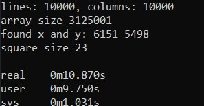
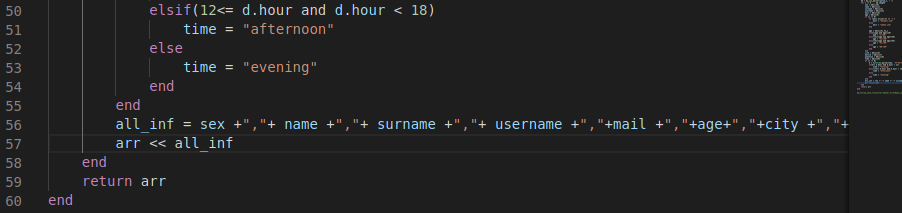

# Qwant my_bsq project

> my bsq will maybe beat yours

---

## Table of Contents

- [How to run](#run)
- [Dynammic Programming](#DynamicProgramming)
- [Bitfields](#Bitfields)
- [Tests](#tests)
- [Team](#team)


---
## run
```shell
$ make
$ ./bsq [input_file.txt]
```

---

## DynamicProgramming

- Our algorithm uses Two-Dimensional array to store minimum values of its previous neighbours plus 1. 2D arrays might take a lot of space when size gets bigger. But we know that
value for current cell is calculated from its adjacent previous neighbours and so on. So after we for example fill up the row on index 'k' we don't need the row on index 'k-1' anymore since the next row (k+1) will be filled by using the row on index 'k'. Therefore instead of creating 2D array of size 'rows * columns' we create only single dimensional arrays of 'columns' size each and consequetively fill each other using its neighbour. And obviously don't lose any data because we store the maximum value of cells in maxSquare and its index
```c

    int found_x = -1, found_y = -1;

    int minValues1[columns];
    int minValues2[columns];

    int *currentMinVal;
    int *aboveMinVal;

    int flag = 0;
    int maxSquareSize = 0;

    for(int i = 0; i < lines; i++){

        if(flag == 0){
            currentMinVal = minValues1;
            aboveMinVal = minValues2;
            flag = 1;
        }else{
            currentMinVal = minValues2;
            aboveMinVal = minValues1;
            flag = 0;
        }

        for(int j = 0; j < columns; j++){
            int bitIndex = i*columns + j;

            if(TestBit(bitField, bitIndex)){
                if(i == 0){
                    currentMinVal[j] = 1;
                }else{
                    if(j == 0){
                        currentMinVal[j] = 1;
                    }else{
                        currentMinVal[j] = 1 + min(aboveMinVal[j-1], aboveMinVal[j], currentMinVal[j-1]);
                    }
                }

                if(maxSquareSize <= currentMinVal[j]){
                    maxSquareSize = currentMinVal[j];
                    found_x = i;
                    found_y = j;
                }
            }else{
                currentMinVal[j] = 0;
            }
        }
    }
```

---


## Bitfields

- using macros created 32 integer data structure that holds bits

```c
#define SetBit(A,k)   ( A[(k/32)] |= (1 << (k%32)) )
#define ClearBit(A,k) ( A[(k/32)] &= ~(1 << (k%32)) )
#define TestBit(A,k)  ( A[(k/32)] & (1 << (k%32)) )

int* getNewBitField(int size){
    int array_size = size/32 + 1;
    int *BitField = malloc(sizeof(int)*array_size);
    printf("array size %d \n", array_size);
    return BitField;
}

void copyToBitFieldFromStr(int *bitField, char *str, int strSize, int index){
    for(int i = 0; i < strSize; i++){
        int k = index+i;
        if(str[i] == '.'){
            SetBit(bitField, k);
        }
        else if(str[i] == 'o'){
            ClearBit(bitField, k);
        }
    }
}
```
---
## tests

- testing with 1k x 1k matrix and density 10



- testing with 10k x 10k matrix and density 10



---

## Team

> Contributors

<p>Nursultan Altayev</p>


<p>Yerzhan Tolysbekk</p>


---
